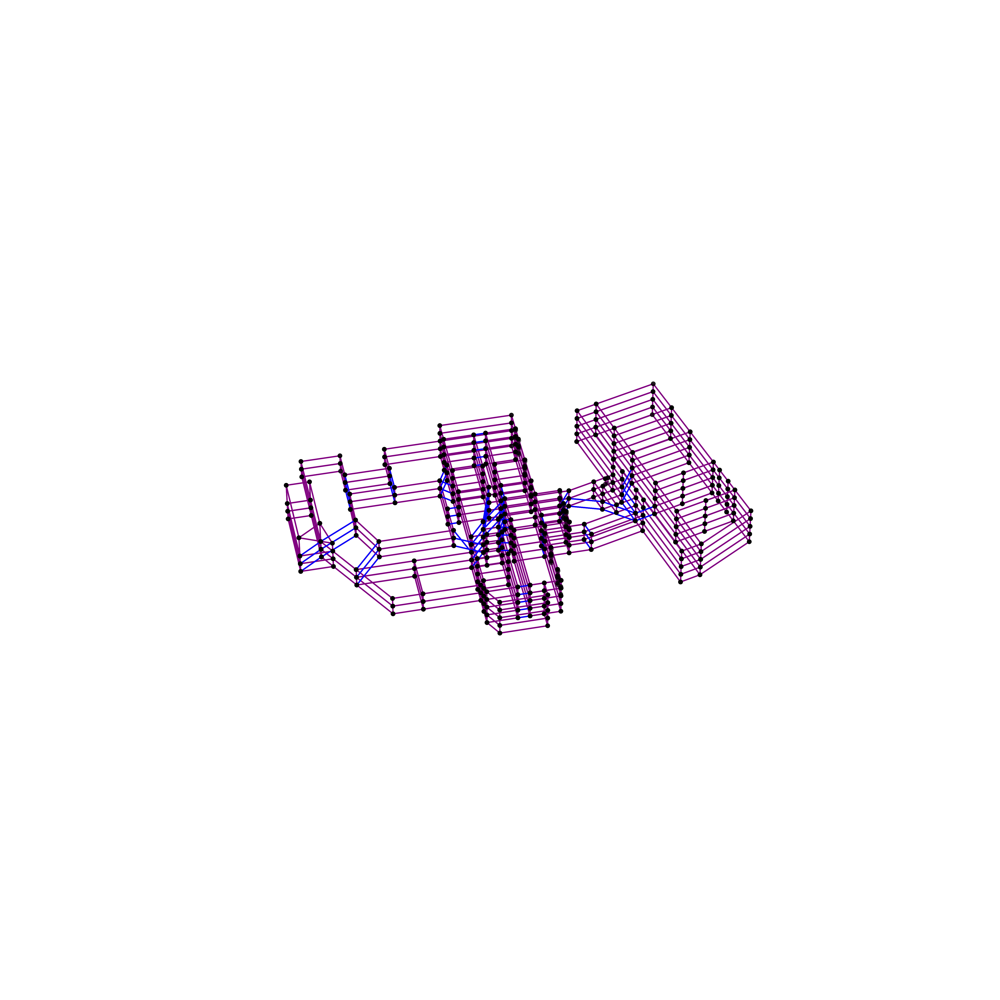
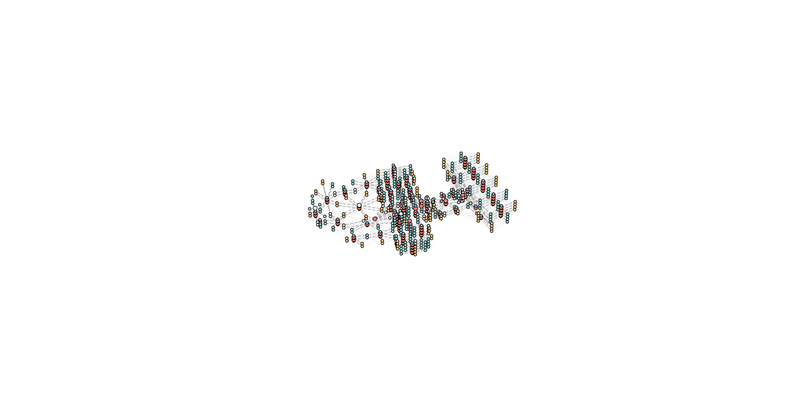

# CUGER_building

## Introduction

**CUGER** is a Python-based open-source representation tool that decomposes complex building shapes/plans into convex geometry **and encodes them into an improved LPG (Logical Property Graph) structure**.  
It further supports **bidirectional conversion between LPG and RDF**, enabling seamless interoperability across heterogeneous building data ecosystems. 🔄

CUGER is not only designed for **converting design models into engineering-level BIM/BEM structures**, but also for **transforming building models into graph datasets for GNN training**—supporting downstream tasks such as performance prediction, spatial reasoning, and surrogate simulation. 🧠📐

Conceptually, the framework draws inspiration from **Arkin, Ronald C. (1987)**, *“Path Planning for a Vision-Based Autonomous Robot.”*

CUGER is built on top of **Moosas**, and to access its full functionality—including building-model conversion, geometric/semantic recognition, and structured graph generation—you need to install both **CUGER** and **Moosas**.  
The algorithm is also integrated into **Moosas+**, and its implementation can be found in: 👉 [`moosas/MoosasPy/encoding`](https://github.com/UmikoXiao/moosas)

## Installation

### Install from git

```bash
git clone https://github.com/Romeo_Leeyh/CUGER_building.git
cd cuger
pip install -e

# or install requirements directly
pip install -r reqirements.txt 
```

### Install Moosas+

If you just want to try the algorithm to split the buiding models, this step can be ignore. For more instructions for installation, please move to Moosas+ [repository](https://github.com/UmikoXiao/moosas).

## Usage

### Example Test

You can run the example test script in `cuger/test.py`.  
This will process the sample building model located at `tests/examples/example0.geo`  
and generate outputs in `tests/examples_results/` as shown below:

```cmd
tests
├── examples
│   └── example0.geo        # Sample test case
└── examples_results
    ├── figure_convex       # Convex decomposition figures
    ├── figure_graph        # Graph visualization figures
    ├── geo_c               # Convex converted geometric files
    ├── graph/example0
    │ ├── edges.json        # Generated graph edges
    │ └── nodes.json        # Generated graph nodes
    ├── new_geo             # Exported .geo files
    ├── new_idf             # Exported .idf files
    ├── new_rdf             # Exported .rdf files
    ├── new_xml             # Exported .xml files
    └── log                 # Processing logs
```

To run the test:

```bash
python tests/test.py
```

### Module I/O Explanation

CUGER operates through a series of processing modules. Each module consumes specific input files and produces standardized outputs that together form the unified graph-based representation of the building model.

#### **Input**

- **`.geo` file**  
  The primary geometric description of the building.  
  This file contains surfaces, edges, vertex positions, and semantic tags used to reconstruct the building’s spatial structure.

#### **Intermediate Outputs**

- **`figure_convex/<case_name>_convex.png`**  
  Visualization of the convex decomposition process, showing how non-convex polygons are split.
- **`figure_graph/<case_name>_graph.png`**  
  Graph-level visualizations illustrating nodes, edges, and spatial relationships.
- **`geo_c/<case_name>_c.geo`**  
  Converted or cleaned geometric files after preprocessing and convex decomposition.

#### **Graph Outputs**


- **`graph/<case_name>/nodes.json`**  
  Encodes all nodes (faces, spaces, openings, etc.) with geometric, semantic, and topological attributes.
- **`graph/<case_name>/edges.json`**  
  Encodes adjacency relations, directional edges, and multi-scale topology for downstream GNN tasks.

<div style="display: flex; gap: 0pt;">
  

  
</div>

#### **Exported Model Formats**

- **`new_geo/<case_name>.geo`**  
  Reconstructed geometry exported back into `.geo` format.
- **`new_idf/<case_name>.idf`** *(in development)*  
  Prototype EnergyPlus IDF export based on the generated graph structure.
- **`new_rdf/<case_name>.owl`**  
  Semantic web representation exported as RDF, suitable for linked-data workflows, which is dumped in `.owl` format.
- **`new_xml/<case_name>.xml`**  
  XML-based representation for interoperability with external BIM or simulation environments.

#### **Logs**

- **`log/<case_name>.txt`**  
  Records the processing pipeline, including geometric checks, convexity reports, and conversion summaries.

## Function 

Developing...

## Citation

If you used this project in your research, please cite the paper below:

```bibtex
@inproceedings{Li2024GraphConvex,
    author    = {Li, Yihui and Xiao, Jun and Zhou, Hao and Lin, Borong.},
    title     = {A Cross-Scale Normative Encoding Representation Method for 3D Building Models Suitable for Graph Neural Networks},
    booktitle = {Proceedings of the Building Simulation Conference 2025},
    publisher = {IBPSA},
    address   = {Brisbane, Australia},
    month     = {August},
    year      = {2025},
    pages     = {},
    doi       = {10.26868/25222708.2025.1305}
}
``` 